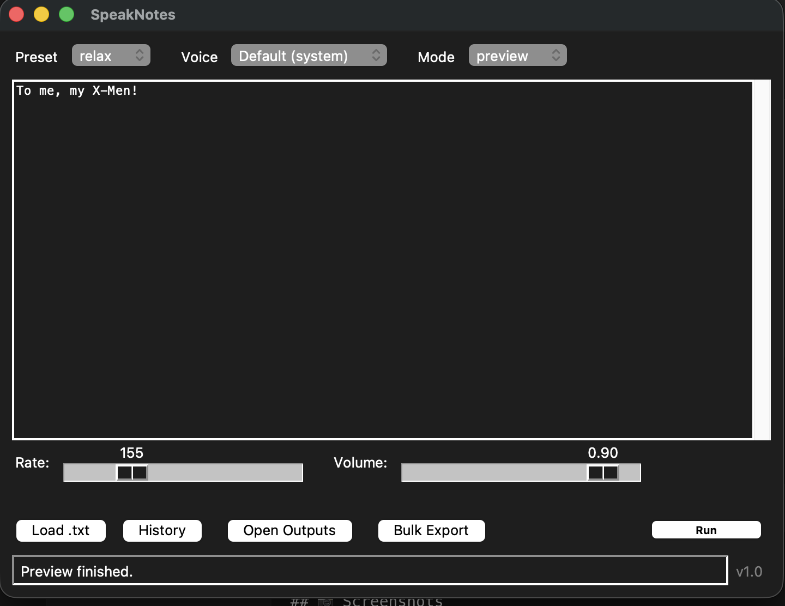
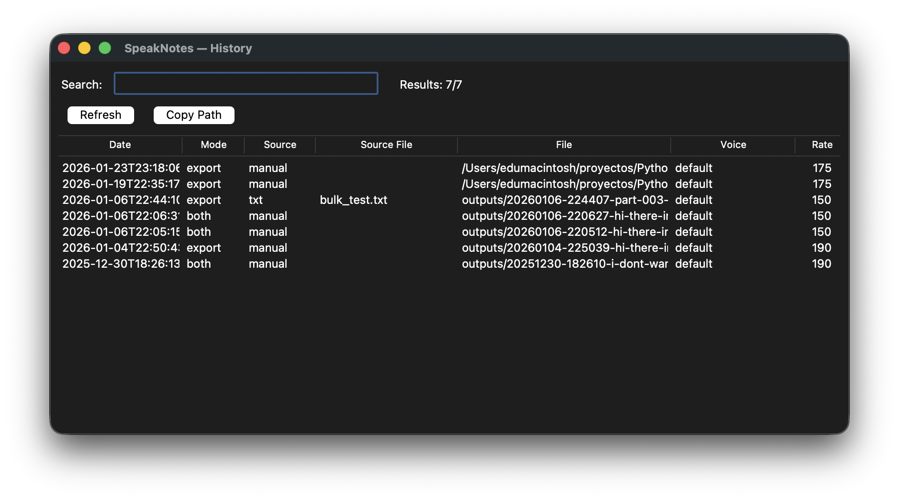

## 📄 SpeakNotes

A lightweight desktop Text-to-Speech utility built with Python + Tkinter, designed for focused reading, note listening, and structured audio exports.

SpeakNotes allows users to preview text as speech, export audio files, manage voice presets, and maintain a searchable history of generated audio.


## ✨ Features
🎙 Core Functionality

Preview text as speech

Export text to .aiff audio files

Preview + Export mode

Bulk export (splits .txt files into paragraphs)

Voice selection (system voices)

Adjustable speech rate and volume

### ⚙️ Smart Controls

Presets (Study, Default, etc.)

Automatic switch to Custom when sliders change

Config persistence (config.json)

Draft autosave (draft.txt)

Mode persistence between sessions

### 🗂 History System

Logs every export

Searchable history

Double-click to open audio

Right-click context menu:

Open

Reveal in Finder

Play (macOS)

Copy path

Delete entry (with optional file deletion)

Handles missing/broken files gracefully

### 🧠 UX & Architecture

Thread-safe speech execution

Clean UI with primary “Run” action

Structured output naming with timestamps

Centralized path handling via APP_ROOT

Version label in status bar


## 🖥 Platform

Currently optimized for macOS

- Uses system say command for reliable speech generation

- .aiff output for native compatibility

Non-macOS fallback uses pyttsx3.


### 🚀 Installation
1️⃣ Clone the repository
```bash
git clone git@github.com:YOUR_USERNAME/text-to-speech.git
cd text-to-speech
```

2️⃣ Create virtual environment
```bash
python3 -m venv venv
source venv/bin/activate
```
3️⃣ Install dependencies

If using macOS system voices only, no additional dependencies required.

For cross-platform fallback:
```bash 
pip install pyttsx3
```
▶️ Run the App
```bash
python3 gui.py
```
📂 Project Structure
```
text-to-speech/
│
├── gui.py
├── history.json
├── draft.txt
├── outputs/
│
├── speaknotes/
│   ├── tts.py
│   ├── presets.py
│   ├── history_utils.py
│   ├── config_utils.py
│   ├── text_utils.py
│   └── macos_say.py
```

### 🧩 Design Decisions
Why Tkinter?

- Built-in, lightweight, zero external GUI dependencies

- Great for demonstrating core Python architecture

Why timestamped filenames?

Ensures:

- No overwriting

- Predictable sorting

- Clear history traceability

Why use APP_ROOT?

- Avoids path inconsistencies when launching from different directories.

Why Mode + Run instead of multiple buttons?

- Cleaner UX.

- Single primary action reduces confusion and improves clarity.

### 🛠 Challenges Solved

Thread-safe UI updates during speech processing

Synchronizing preset logic with manual slider overrides

Consistent path resolution across OS environments

History file normalization (relative vs absolute paths)

Preventing UI freeze during long exports

Designing a clean, non-cluttered interface

### 📌 Future Improvements

Sortable history columns

Dark mode

Audio waveform preview

Export format selection (mp3/wav)

Installer packaging


### 📷 Screenshots

### Main Window


### History View


### Right-click Menu open


## 📜 Version

v1.0


## 👨‍💻 Author

Eduardo S.
Python Developer

Built as a portfolio project to demonstrate:

Python application architecture

GUI design

File handling

Threading

Refactoring discipline

Clean UI decisions
